# 1、SpringBoot创建项目

## 方式1：网站,start.spring.io

主流框架spring boot 有官方网
start.spring.io/start.aliyun.con

### 1、创建demo


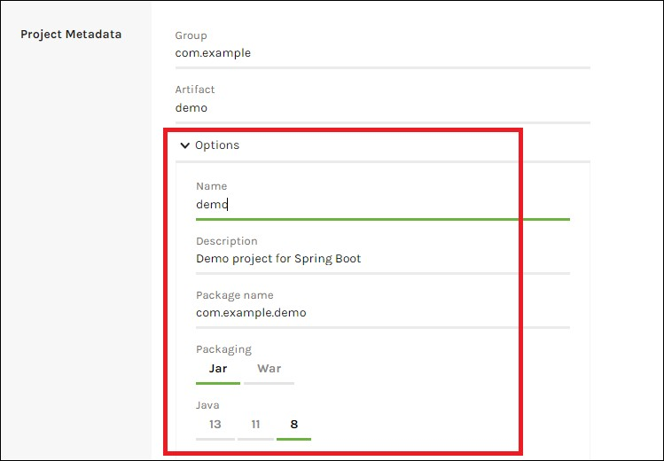

### 2、配置依赖


依赖：

+ Spring Web
+ MySQL Driver//mySQL驱动
+ MyBatis Framework//框架，简化mySQL操作。
+ Lombok//插件
+ Spring Boot DevTools//开发工具包
+ Thymeleaf//模板引擎

创建后，下载。

解压压缩包，在idea中打开。

### 3、配置阿里云源

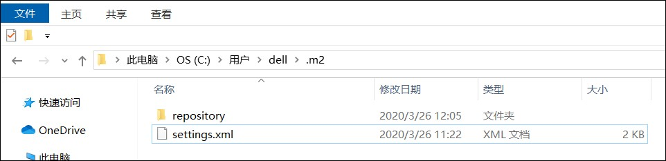

#### settings.xml内容

```xml
<?xml version="1.0" encoding="UTF-8"?>

-<settings xsi:schemaLocation="http://maven.apache.org/SETTINGS/1.0.0 http://maven.apache.org/xsd/settings-1.0.0.xsd" xmlns:xsi="http://www.w3.org/2001/XMLSchema-instance" xmlns="http://maven.apache.org/SETTINGS/1.0.0">

<pluginGroups> </pluginGroups>

<proxies> </proxies>

<servers> </servers>


-<mirrors>

<!-- 阿里云仓库 -->


-<mirror>

<id>alimaven</id>

<mirrorOf>central</mirrorOf>

<name>aliyun maven</name>

<url>http://maven.aliyun.com/nexus/content/repositories/central/</url>

</mirror>

<!-- 中央仓库1 -->


-<mirror>

<id>repo1</id>

<mirrorOf>central</mirrorOf>

<name>Human Readable Name for this Mirror.</name>

<url>http://repo1.maven.org/maven2/</url>

</mirror>

<!-- 中央仓库2 -->


-<mirror>

<id>repo2</id>

<mirrorOf>central</mirrorOf>

<name>Human Readable Name for this Mirror.</name>

<url>http://repo2.maven.org/maven2/</url>

</mirror>

</mirrors>

<profiles> </profiles>

</settings>
```


### 4、查看版本号


### 5、修改配置文件

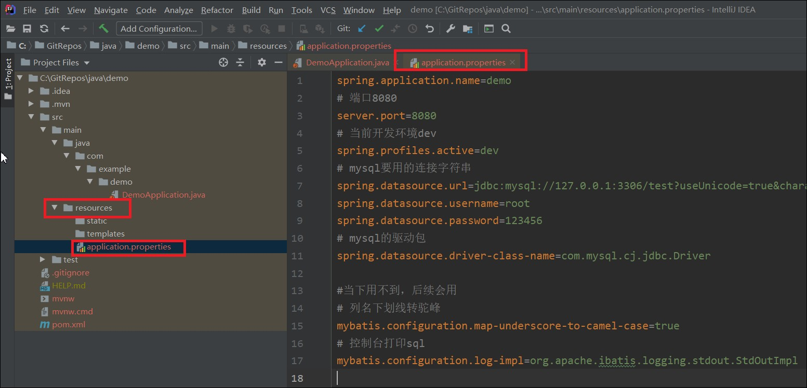

```properties
spring.application.name=demo
# 端口8080
server.port=8080
# 当前开发环境dev
spring.profiles.active=dev
# mysql要用的连接字符串
spring.datasource.url=jdbc:mysql://127.0.0.1:3306/test?useUnicode=true&characterEncoding=utf8&useSSL=false&zeroDateTimeBehavior=convertToNull&serverTimezone=Asia/Shanghai
spring.datasource.username=root
spring.datasource.password=123456
# mysql的驱动包
spring.datasource.driver-class-name=com.mysql.cj.jdbc.Driver

#当下用不到，后续会用
# 列名下划线转驼峰
mybatis.configuration.map-underscore-to-camel-case=true
# 控制台打印sql
mybatis.configuration.log-impl=org.apache.ibatis.logging.stdout.StdOutImpl
```

+ 


### 6、创建文件:HelloController

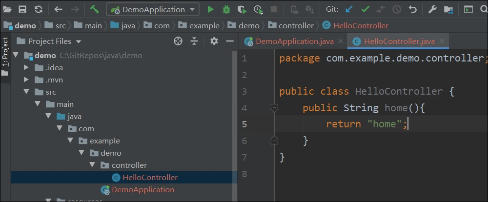

###  7、创建home.html

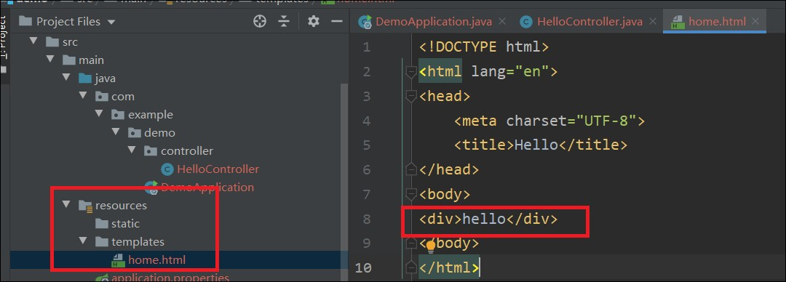

### 8. 补充修改：HelloController

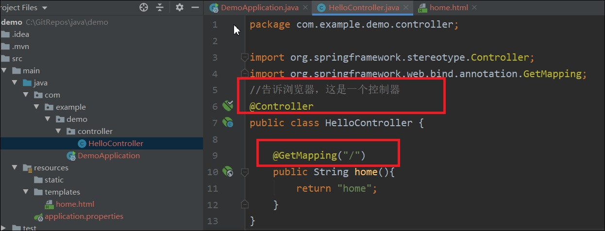

运行DemoApplication。访问localhost:8080,显示hello，成功

## 方式2：idea

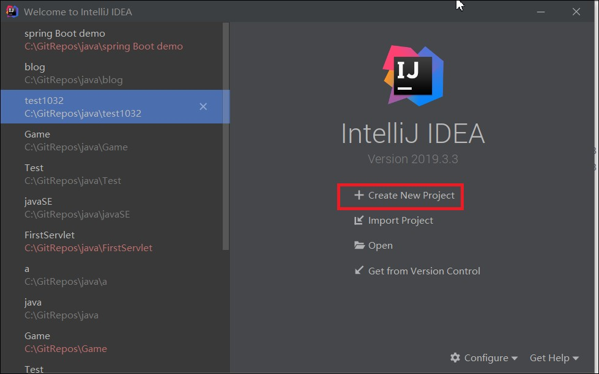


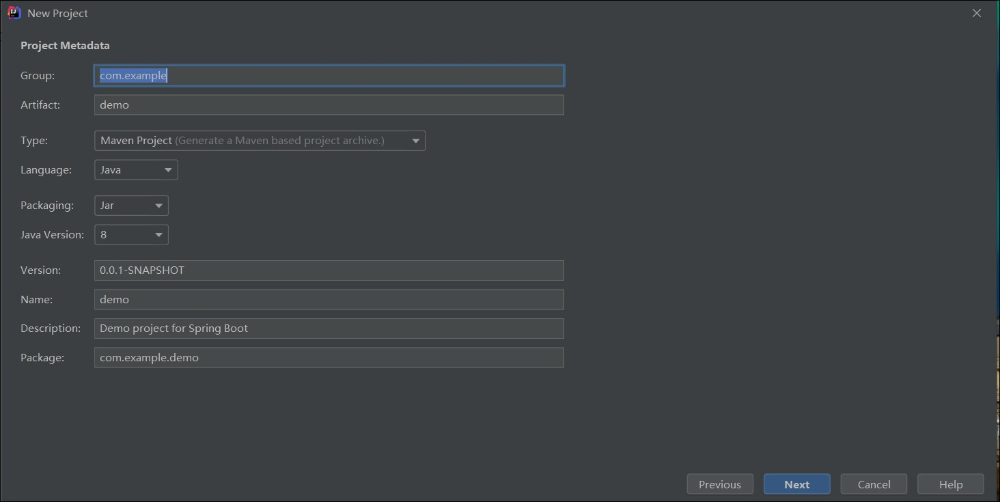

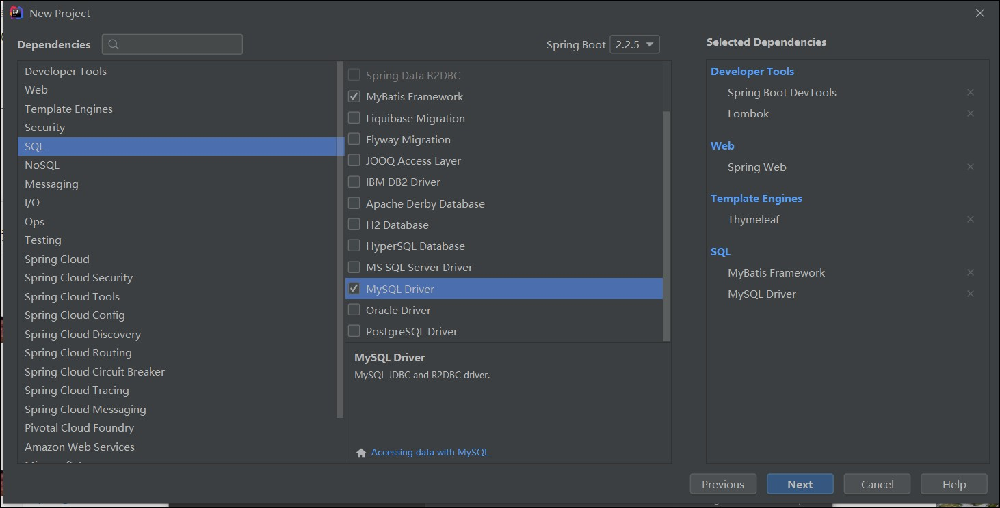

# 2、mvc

m  -model，

v -view,视图，resources下的HTML文件

c  -controller，控制器

## 1、v，c的应用

controller文件中return的是home，显示的就是home.html文件内容

controller文件中return的是detail，显示的就是detail.html文件内容

templates，意思：**模板**

```java
public class HelloController {

    @GetMapping("/")
    public String home(){
        return "home";
    }
}
```

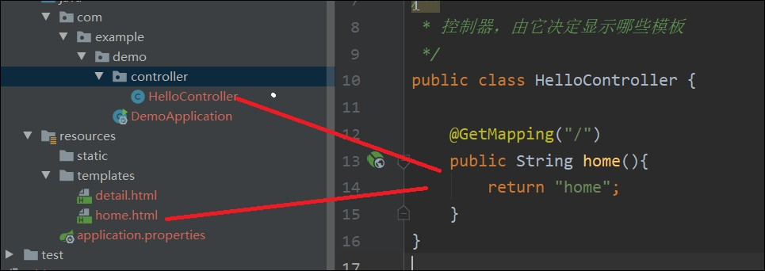

## 2、model的应用

1、引入model

2、向model中添加元素

3、在对应的html文件中编写、添加标记<font color=red>       默认标记是错的，需要更改</font>

```
xmlns:th="http://www.thymeleaf.org"
```

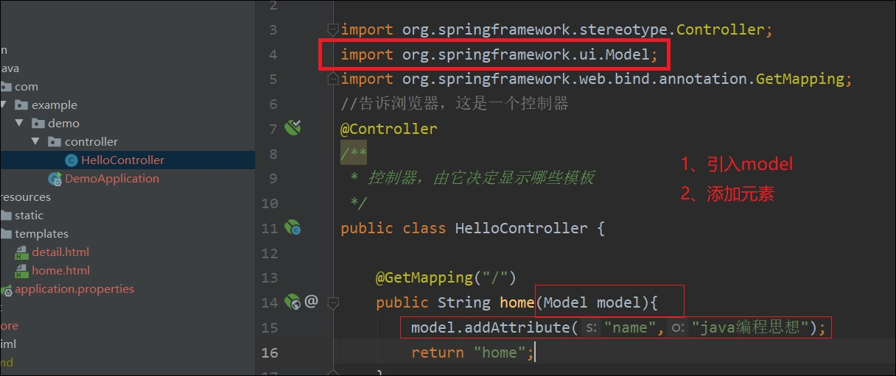

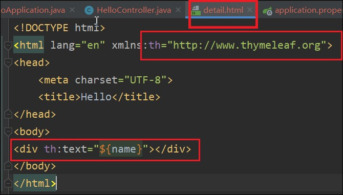

# 2、创建基本数据类，页面跳转 

创建entity包   [ˈentəti]，实体

demo文件下建一个entity包。entity存放实体类

创建book类

```java
package com.example.demo.entity;
import lombok.Data;
import java.math.BigDecimal;

@Data
public class Book {
    private int id;
    private String name;
    private int categoryId;
    private BigDecimal price;
    private String isbn;
}
```

## 3、控制器中创建集合，添加数据，加入model

```java
List<Book> bookList=new ArrayList();
bookList.add(new Book(7,"物理",1,3,"4","sdf"));
bookList.add(new Book(8,"物理",1,3,"4","sdf"));
model.addAttribute("bookList",bookList);
```

#### <font color=red>### 此处IDEA报错。提示创建构造函数</font>

解决方案：运行报错。然后装个lombok插件。

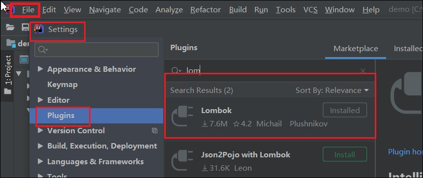


## 4、html中循环数据

```html
<ul>
    <li th:each="book: ${bookList}">
        <a href="" th:text="${book.name}"></a>
    </li>
</ul>
```

第一行{ }中名字和控制器中名字一样

## 5、跳转

```java
 <a th:href="@{ 'detail?id=' + ${book.id} }" th:text="${book.name}"></a>
```

跳转格式：

```java
th:href="@{ 'detail?id=' + ${book.id} }"
```

跳转后的页面在控制器中写代码

```java
    @GetMapping("/detail")
    public String detail(Model model, HttpServletRequest request){
        int id= Integer.parseInt(request.getParameter("id"));
        Book book=new Book(id,"hahaha",1,1,"3","dsf");
        model.addAttribute("book",book);
        return "detail";
    }
```

然后再templates中写对应的html页面

# 3、操作数据库

## 1、创建数据库，插入数据

```mysql
CREATE TABLE `book`(
  `id` int (11) NOT NULL AUTO_INCREMENT,
  `name` varchar(50) NOT NULL DEFAULT '' COMMENT '书名',
  `category_id` int(3),
  `quantity` int(5),
  `price` decimal(5,2) COMMENT '价格',
  `isbn` varchar(20) ,
  PRIMARY KEY (`id`)
)ENGINE=InnoDB DEFAULT CHARSET=utf8mb4;
```

 

```mysql
insert into book (name,category_id,quantity,price,isbn) values
(
'java',1,10,100,12345),
('c',2,10,10,2345),
('js',3,10,10,345),
('数学',4,10,100,12345),
('语文',5,10,10,2345),
('英语',6,10,10,345);

```

## 2、创建mapper  意思：**映射**

创建包mapper,用于数据库和entity的映射

### 1、创建接口BookMapper

```java
package com.example.demo.entity.mapper;
import com.example.demo.entity.Book;
import org.apache.ibatis.annotations.Select;
import java.util.List;

public interface BookMapper {
    @Select("SELECT * FROM book")
    List<Book> findBooks();
}
```

### 2、去控制器依赖注入

```java
@Autowired//自动注入
BookMapper bookMapper;
```

下面就可以直接使用

```java
List<Book> bookList=bookMapper.findBooks();
```

### 3、添加@MapperScan

在DemoApplication中添加@MapperScan("com.example.demo.mapper")

```java
@SpringBootApplication
@MapperScan("com.example.demo.mapper")
public class DemoApplication {

   public static void main(String[] args) {
      SpringApplication.run(DemoApplication.class, args);
   }

}
```

详情页面的查询

Mapper中添加一条接口

```java
@Select("SELECT * FROM book WHERE id=#{id}")
Book findBookById(@Param("id") int id);
```


控制器中添加语句

```java
int id= Integer.parseInt(request.getParameter("id"));
Book book=bookMapper.findBookById(id);
model.addAttribute("book",book);
```