### github

#### 基本概念

##### 仓库（Repository）

##### 收藏（Star）

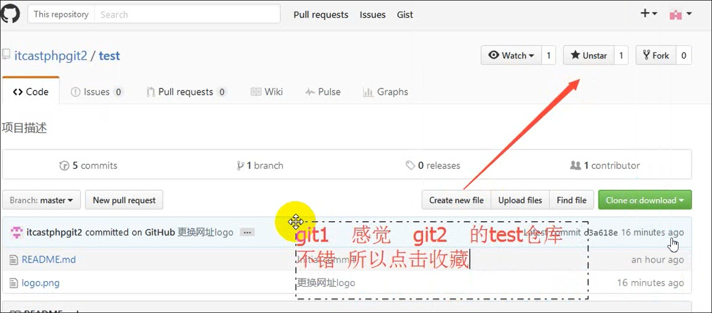

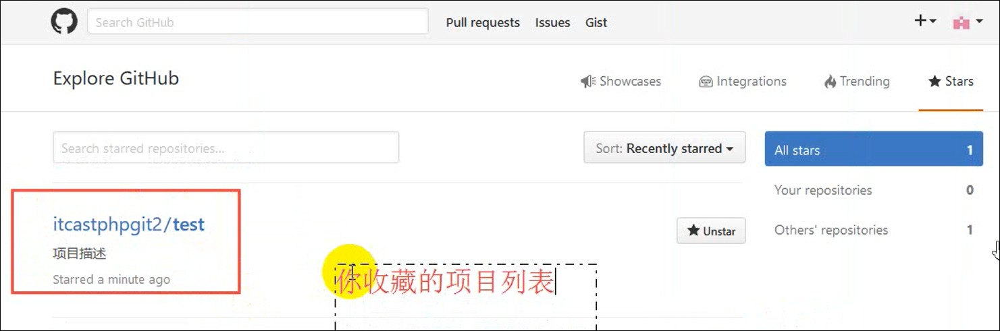

##### 复制克隆项目（Fork）

Fored from 别人

克隆的别人的项目

该项目是独立存在的

自己不可以私自更改项目。若要更改，会向发起人发送pull request，同意后，项目更改。

##### 关注（watch）

关注项目，项目更新可以接收通知

##### pull request

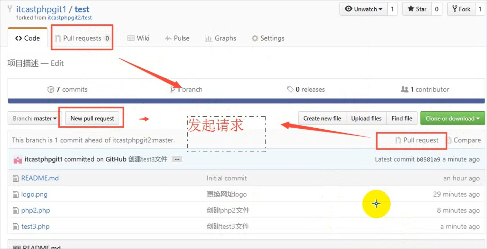


##### 事务卡（Issue）

发现代码bug，当是目前没有成型代码，需要讨论是用。

##### Repository name 

一般就是项目名称

##### README 

详细描述项目

#### 三个主页的基本概念

##### github主页

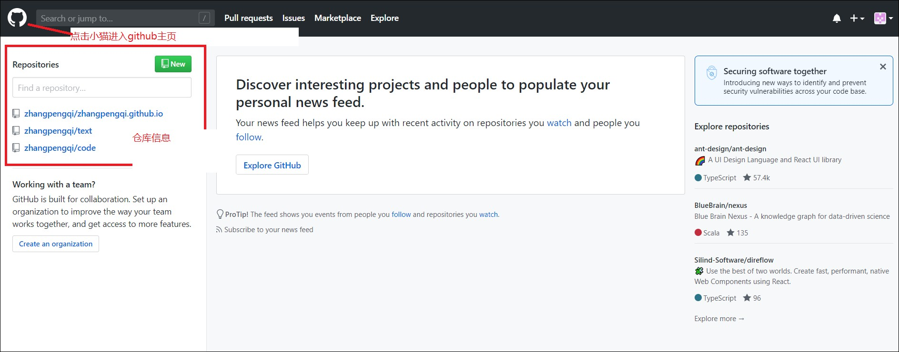

##### 仓库主页

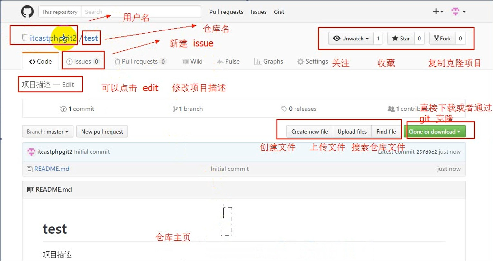

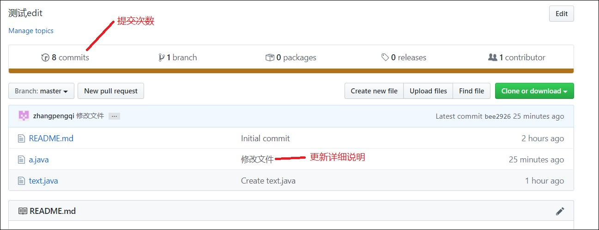

##### 仓库文件主页

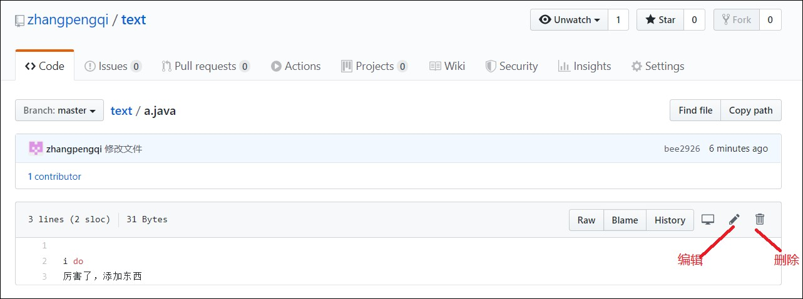


##### 个人主页

点击进入个人主页

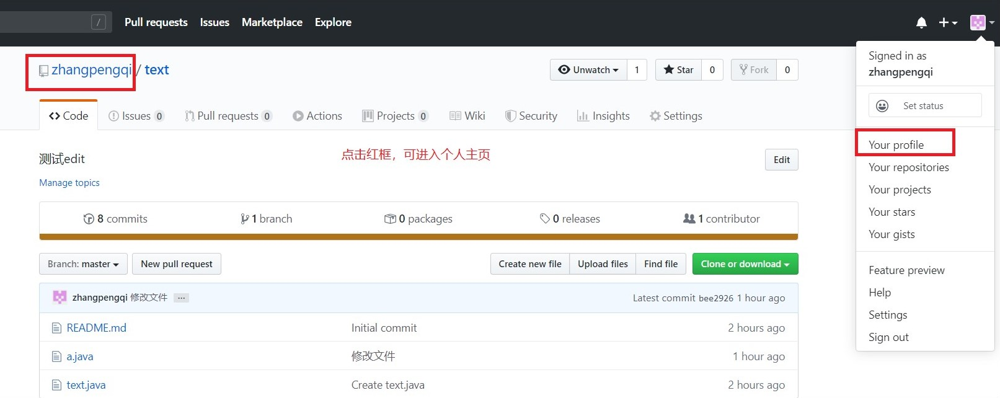

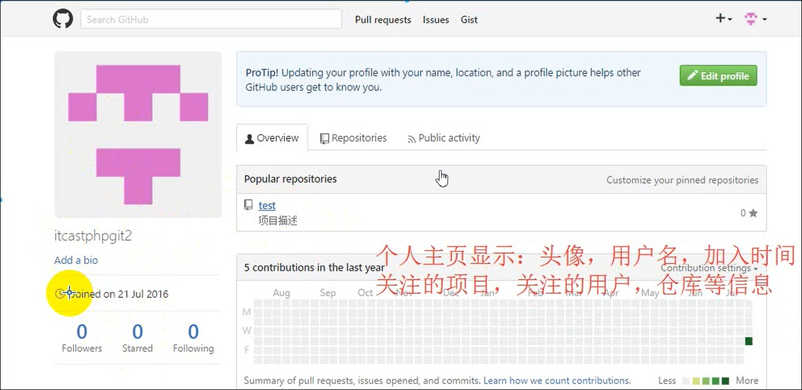

#### 开源项目贡献流程

#### 					1.新建issue，

​			提交试用问题，建议或想法

#### 		2.pull request


​		步骤：

​				1.fork项目

​				2.修改自己仓库的项目代码

​				3.新建pull request

​				4.等待作者操作审核

### git流程


#### Git工作区域

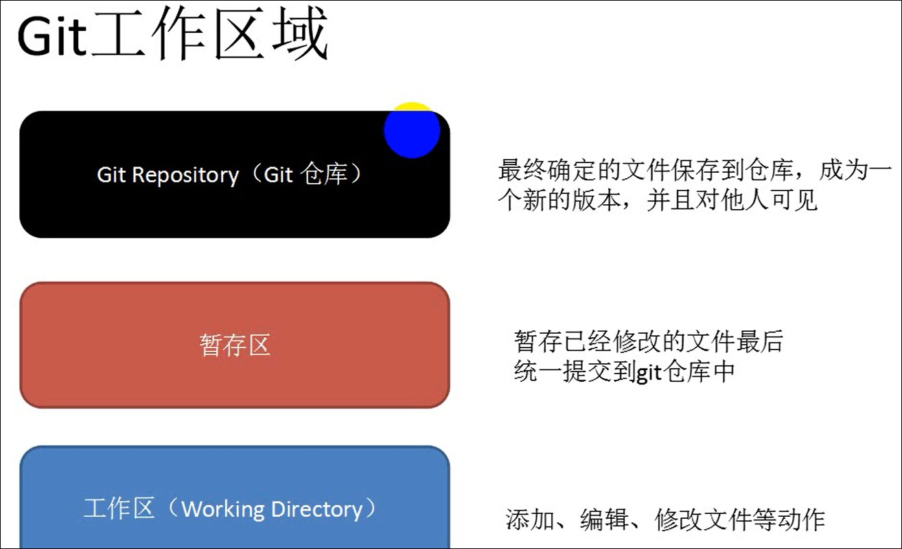

#### 向仓库中添加文件基本流程

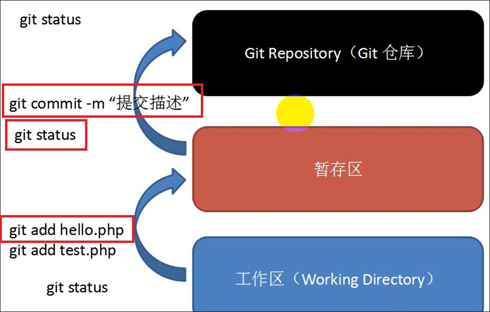

#### git基础设置

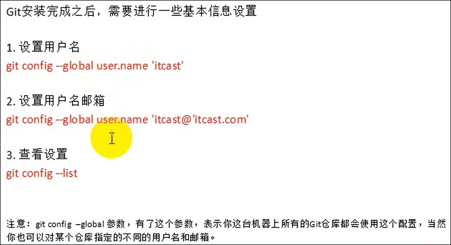

#### 向仓库添加文件

##### 1.初始化新的git仓库

进入文件。在文件内输入命令

git init

##### 2.添加到暂存区

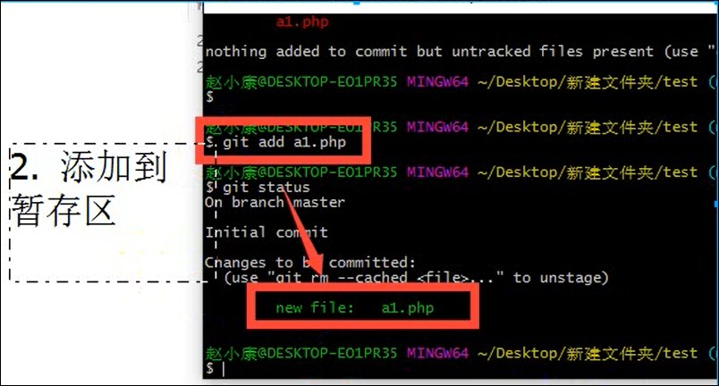

##### 3.从暂存区添加到仓库

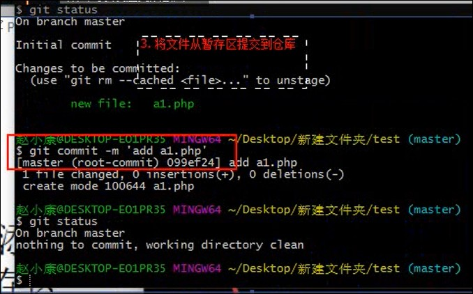

#### 修改文件

##### 1.修改文件

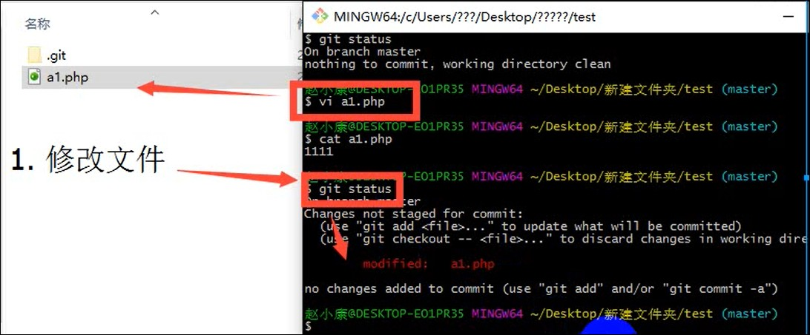

##### 2.添加到暂存区，命令

```
add 文件名
```

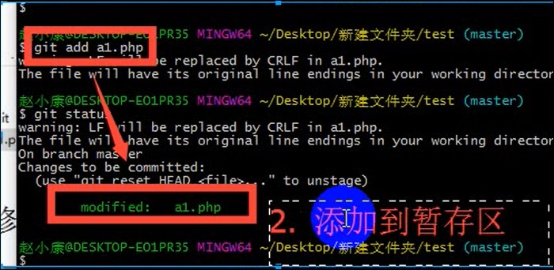

##### 3.添加到仓库

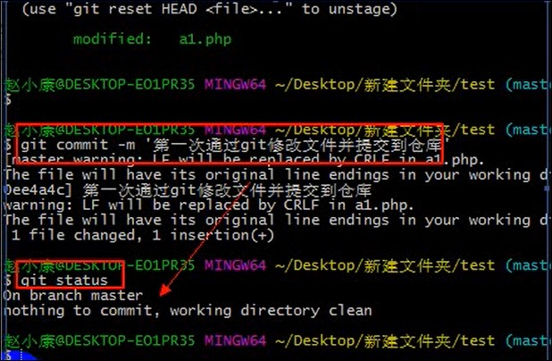

### 远程仓库管理

使用远程仓库目的：

备份，实现代码恭喜集中化管理

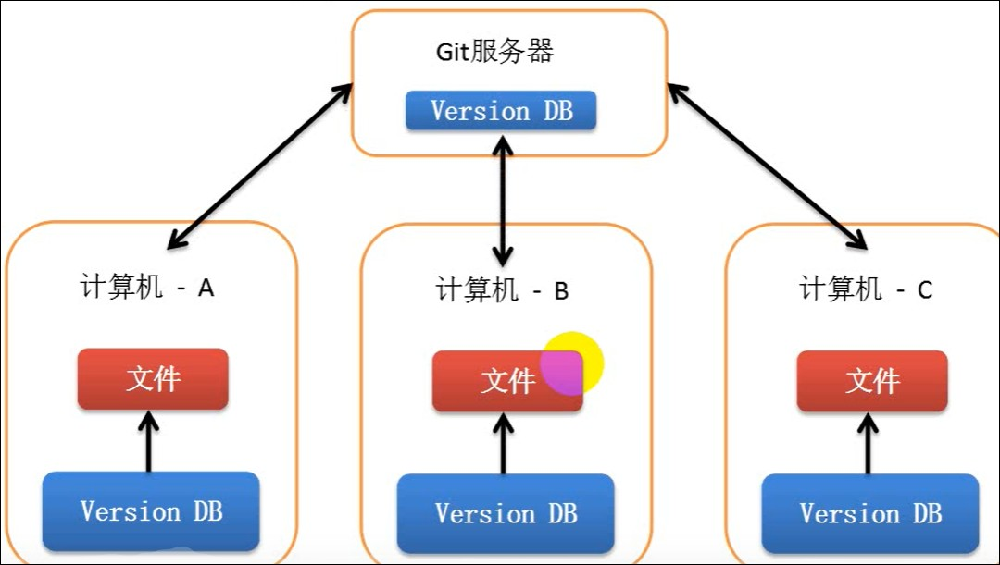

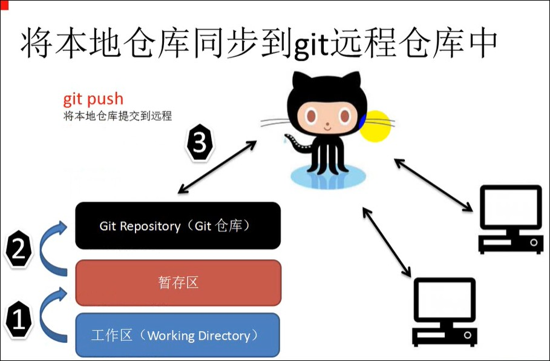

### 搭建个人网站


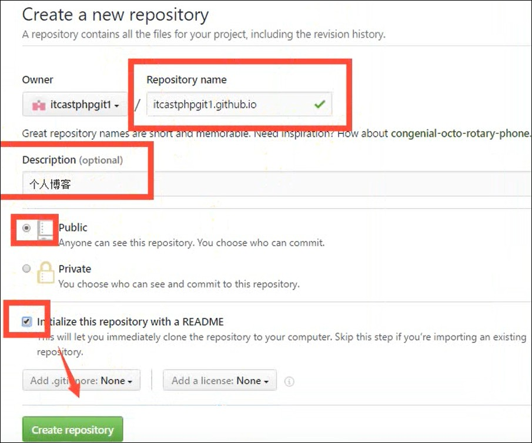

### Project pages 项目站点

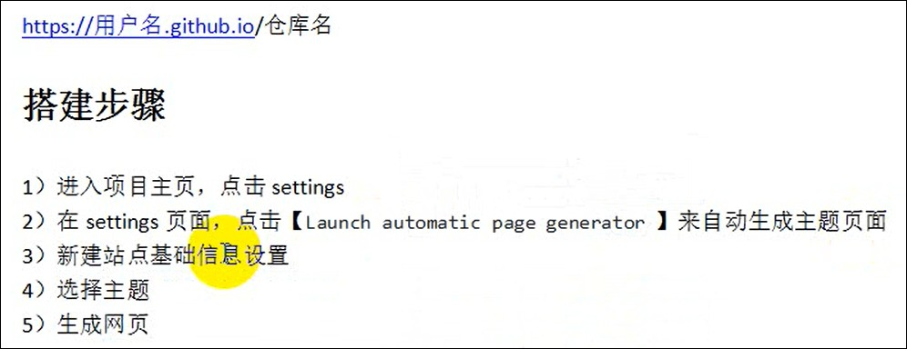